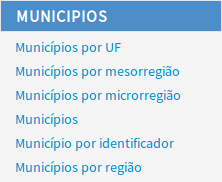
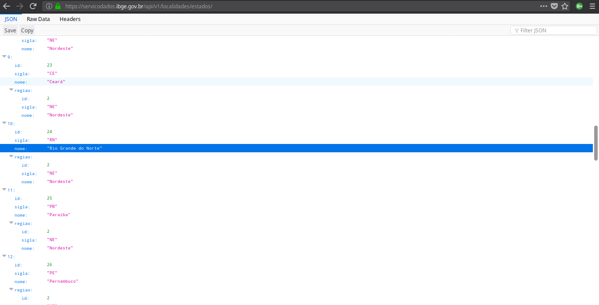
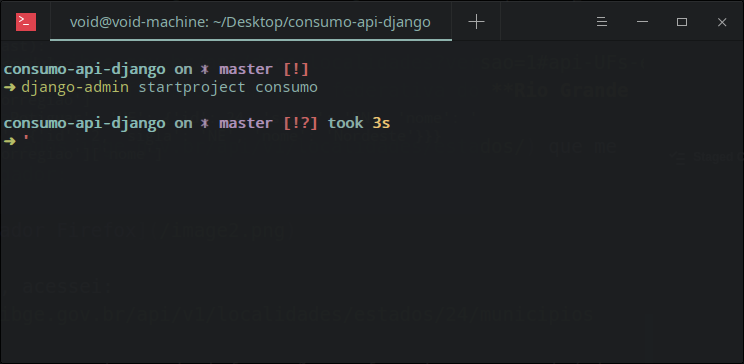
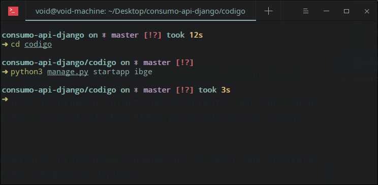
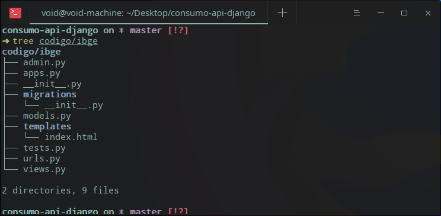
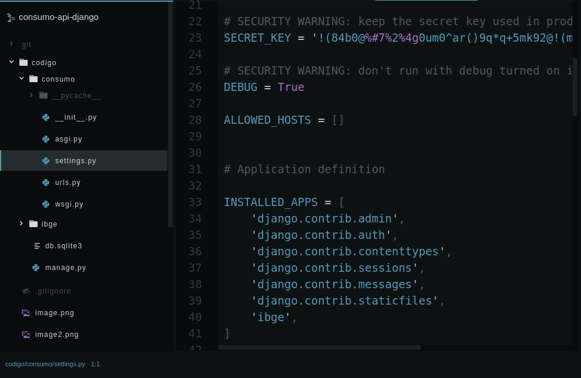
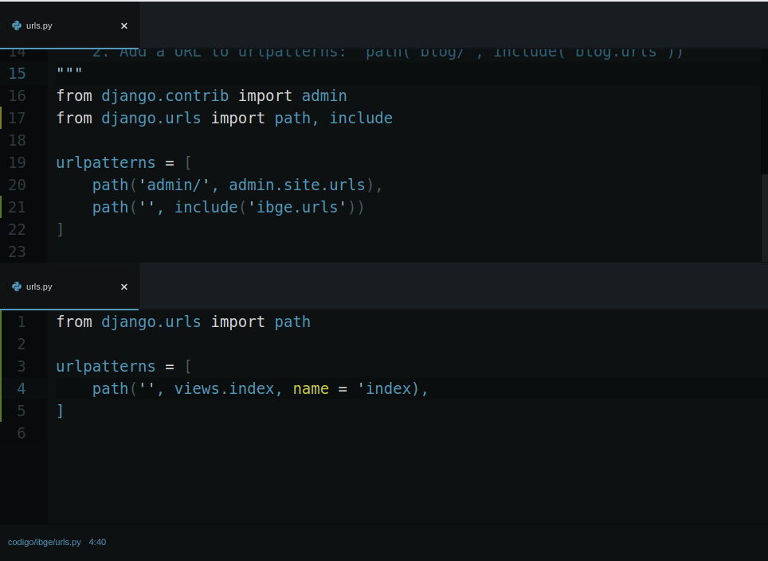
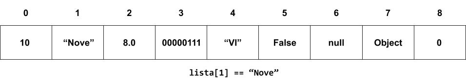
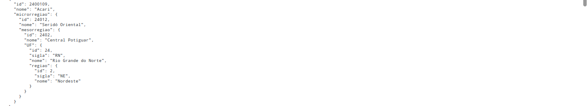

# Tutorial: consumindo uma API com Django
O objetivo deste tutorial é compartilhar
o conhecimento obtido por mim após dois dias de pesquisa sobre como consumir uma API usando Django. Precisei disso para o meu projeto integrador na faculdade e estava batendo cabeça porque, às vezes, um arquivo JSON é muito grande e é difícil de manipulá-lo, já que Python não oferece isso de forma nativa. Depois de muita pesquisa, finalmente consegui construir um front-end, ainda que arcaico, mas consumindo de uma API em produção.

## O que isto é

- **Compartilhamento de conhecimentos**: este projeto pretende passar o conhecimento que o autor obteve através de pesquisas

## O que isto não é

Este tutorial não pretende ensinar, completamente:

- **Django**: a comunidade do Django tem uma documentação ótima! Você pode acessá-la [clicando aqui](https://www.djangoproject.com/). Pretendo fazer um outro projeto compartilhando meu conhecimento sobre Django também, mas não é o caso deste repositório

- **Python**: a [W3Schools](https://www.w3schools.com) oferece um [tutorial ótimo](https://www.w3schools.com/python/default.asp) sobre Python. Embora eu vá explicar um pouco sobre estruturas de dados da linguagem, não será uma coisa profunda.

- **HTML**: não vamos usar muitos elementos HTML aqui, mas você também pode acessar um [tutorial completo na W3Schools](https://www.w3schools.com/html/default.asp)

- **APIs REST**: definitivamente, não! Sequer usaremos muitos verbos HTTP. Só usaremos o GET. Mas não vamos aprender os princípios REST.

- **Manipulação de JSONs**: o nosso trabalho com JSON será decodificá-lo para uma estrutura que seja compreensível ao Python. Mas é um assunto interessante de se aprender, se você está querendo se aprofundar em consumo de APIs. A W3Schools tem uma [subseção sobre isso](https://www.w3schools.com/js/js_json_intro.asp)

É bastante recomendável que você tenha tido um pré-contato com os itens acima, embora, ocasionalmente, alguns desses assuntos possam vir a ser discutidos brevemente em algum momento

## Funcionamento

Para construir o conhecimento de forma mais concisa, você poderá acompanhar a explicação deste arquivo e todo o código gerado estará disponível na pasta [/codigo](/codigo)

---

# Tutorial

## API: IBGE

Inicialmente, precisaremos escolher uma API existente que nos retorne dados sem necessidade de autenticação, isto é, dados aos quais não precisamos nos identificar para ter acesso. O IBGE, em seu [site de APIs](https://servicodados.ibge.gov.br/api/docs), disponibiliza mais ou menos 12 serviços do tipo. Vamos escolher a API de **localidades**, que é referente às divisões político-administrativas do Brasil. Você pode ler a documentação referente: [API de localidades](https://servicodados.ibge.gov.br/api/docs/localidades?versao=1). Quando fizermos uma requisição do tipo GET para o endereço do serviço, a API nos retornará um JSON carregado de informações referentes.

### Escolha dos recursos
APIs geralmente são baseadas em recursos. Na documentação, conseguimos encontrar a descrição de cada um deles. Mas, a título do exemplo, escolheremos o que nos retorna um JSON carregado de municípios de determinada unidade federativa:

Mas para isso, precisamos antes ter em mãos o id da unidade federativa. Em [outra seção do site](https://servicodados.ibge.gov.br/api/docs/localidades?versao=1#api-UFs-estadosGet), conseguimos o id 24, referente a unidade federativa do **Rio Grande do Norte**, inspecionando o [JSON](https://servicodados.ibge.gov.br/api/v1/localidades/estados/) que nos é retornado no navegador:

**Observação**: Para ter essa visualização, precisei acessar o [endereço](https://servicodados.ibge.gov.br/api/v1/localidades/estados/) pelo Mozilla Firefox. Caso você utilize outro navegador, o retorno talvez possa não ser formatado. Nesse caso, o que você verá é um texto em formato JSON.

De posse do ID, acessaremos: https://servicodados.ibge.gov.br/api/v1/localidades/estados/24/municipios

Esse é o endereço que será efetivamente utilizado. Ele nos retorna todos os municípios do Rio Grande do Norte, bem como informações de sua micro e mesorregião.

## Projeto Django

Para consumir esses dados, precisaremos apenas das views e dos templates do Django, portanto, podemos ignorar toda a parte dos models e da ORM.

Assumindo que você tenha o módulo `django` instalado no Python, poderemos iniciar o projeto em termos de código:

**Observação:** após iniciar o projeto, renomeei a pasta gerada para _codigo_.

E depois, uma aplicação chamada `ibge`:

### Configuração básica

Na pasta da aplicação, criaremos um diretório chamado _templates_, contendo um arquivo _index.html_. Subindo um nível, criaremos um arquivo chamado _urls.py_:

Adicionaremos a aplicação ao projeto:

- **Por que tenho que seguir o passo acima se não vamos usar a parte do models?** Porque, mais a frente, usaremos os templates. Caso esse passo não seja executado, o Django é incapaz de achar esse template dentro do projeto.

Após isso, teremos que configurar as rotas:

Na imagem acima, temos dois arquivos de URLs abertos. O de cima é o o projeto. O de baixo, é o recém-criado, da aplicação.

- **Observação**: no arquivo de baixo, linha 4,  não há uma aspa de fechamento em _name_. Já arrumei o código no repositório. A desencargo de consciência, o código correto é: `path('', views.index, name = 'index'),`

Depois de seguir este passo-a-passo, você pode conferir se os seus códigos estão corretos. Acesse a pasta [/codigo](/codigo).

## Views do Django

No código das [views](/codigo/ibge/views.py) da aplicação, precisaremos:

1. Importar o módulo `requests` (talvez você tenha que instalá-lo pelo pip: `pip install requests`)

2. Definir a função responsável pela lógica de retorno à solicitação do usuário

3. Fazer a requisição à API anteriormente escolhida

4. Decodificar o JSON recebido

5. Passar o JSON decodificado como contexto no retorno da função

Então:

- Na linha 2, importamos o módulo que trabalha com as requisições HTTP

- Na linha 4, abrimos a função que atenderá ao usuário quando ele digitar a URL [localhost:8000](localhost:8000)

- Na linha 6, acionamos o método `get()` do módulo requests, passando um str como parâmetro. Esse str deve ser um endereço acessível na internet
  - Se OK, a requisição viaja até a API e faz uma solicitação get

- Na linha 7, tratamos a resposta de `requisicao`
  - **O método `json()` só sera bem sucedido no str de resposta de `requisicao` se for escrito em formato JSON**

- Na linha 8, declaramos um dict vazio
  - `dicionario` vai armazenar os valores de uma lista, que eu não conseguia passar como contexto

- Na linha 10, estamos preenchendo nosso dict

- Na linha 12, colocamos esse dict em uma variável que será encaminhada para o template

- Na linha 16, a view retorna o template index.html para o usuário e a variável de contexto para o desenvolvedor

### Dificuldades enfrentadas

O código nem sempre foi redondinho assim. No começo, eu bati bastante a cabeça! Foi aí que entraram os dois dias de pesquisa. Basicamente:

1. Eu não sabia o que era JSON realmente

2. Não entendia a diferença entre um dicionário Python e um JSON

3. Não entendia porque o template me retornava uma exceção _unhasable type_ toda vez que eu tentava passar o retorno de `requisicao.json()` diretamente para o template

Depois dessas pesquisas, eu descobri que:

1. JSON, ao contrário do que eu pensava, não é a mesma coisa que um dict Python. Em primeiro lugar, JSON é uma string escrita em síntaxe de objetos JavaScript. Isso implica a qualquer string escrita em JSON poder representar um objeto JavaScript. Ao mesmo tempo, é um formato que independe de linguagem. Já um dicionário Python é uma estrutura de dados, representa dados na memória do servidor e é acessado por uma espécie de índice, que se chama _chave_. Apesar da semelhança, JSON ainda é str. Quando um servidor troca informações com o navegador web, a informação só pode ser texto.

2. JSONs e dicts tem uma apresentação visual bastante parecida. Por esse motivo, não conseguia notar diferença entre um e outro. Veja: 
De início, criei um dicionário e um JSON que guardava esse dicionário. Quando eu ia imprimir os dois não via absolutamente nenhuma diferença, salvo pelo tipo de aspa. Então, olhei o tipo de um e de outro, só para uma inquietação maior. Não fazia sentido algum que um fosse dict e o outro str! Mas aí comecei a olhar na W3Schools as [especifidades de formatação](https://www.w3schools.com/js/js_json_intro.asp) e notei o que já estava na minha frente: **JSON é texto** escrito sob uma notação específica! Então, para garantir, pedi os valores dos objetos sem a função `print()`, que retorna apenas uma representação textual dos objetos. Dessa forma, consegui ver os dois objetos tais quais estavam escritos na memória do servidor. **Eureka!** Então, o tempo todo, era isso: JSON é só um str, que pode virar um dict. Dict é uma estrutura de dados.

3. Já sabia que JSON era texto. Sabia também que Python tem um módulo `json` que, dentre outras coisas, convertia str no formato para dicts. O que eu não sabia era porquê ora `json()` retornava um list, ora retornava um dict. Para a URL que estamos trabalhando, `json()` sempre retornaria uma lista, que não podia ser compreendida pelo template. Em outras APIs, sempre um dict. Tentei fazer de tudo! Até escrever o valor como JSON puro em uma variável JavaScript para depois tratá-lo, mas sem sucesso. Consumei esta API como _toda bugada_ e fui trabalhar na [API Nomes](https://servicodados.ibge.gov.br/api/docs/censos/nomes?versao=2). Até que consegui produzir algo: era uma página em que o usário preenchia seu nome em um input e o sistema redirecionava para outra página que informava quantas vezes o seu nome havia aparecido em pesquisas do censo. Era legalzinho, mas eu estava frustado demais com o _list de municípios_. Foi aí então que me ocorreu de converter a lista em um dicionário! Precisava pegar cada valor da lista, e associá-lo a uma chave. E foi aí que fiz um desenho na minha cabeça:

Listas são como arrays, mas podem guardar qualquer tipo de valor. Os valores de cada item da lista são acessados pelos índices. Os índices são dados pela sequência. Por algum motivo, o template gerava uma exceção _unhasable type_ quando eu tentava passar a lista. Então, o que me restava era converter a lista para um dicionário com funcionamento muito parecido com o da lista. Voltei à ideia original e fiz um loop na lista. Consegui converter. Então, o template já não apresentava mais exceções e eu podia ir para a codificação no template.

## Templates do Django
No [código de template](/codigo/ibge/templates/index.html), fazemos uso de um HTML simples, misturado com alguns padrões da _linguagem de templates Django_
- Na linha 10, fazemos um loop dentro do dicionário que foi passada dentro da variável de contexto na view
  - O dicionário vem carregado de int, str e outros dicts:

  

  - Temos, para cada item do dicionário um id (int), um nome (str) e uma microrregião (dict).
- Com esses dados, podemos mostrar ao usuário:
  - O nome de cada municipio
  - O id de cada municipio
  - O nome de cada microrregião
  - O nome de cada mesorregião
